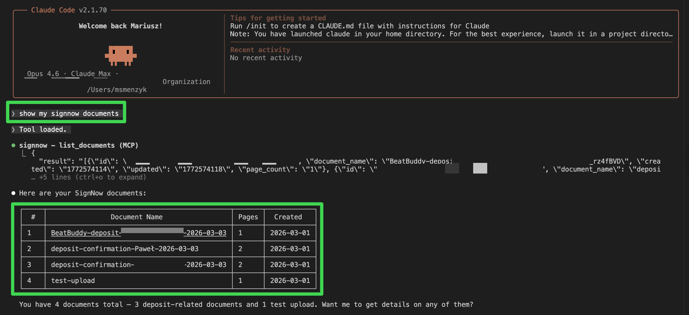

# signnow-mcp

Unofficial [Model Context Protocol](https://modelcontextprotocol.io/) (MCP) server for [airSlate SignNow](https://www.signnow.com/) e-signatures.

Upload documents, send signing invites, check status, download signed PDFs, and manage templates - all from Claude Code or any MCP-compatible client.

> **Note:** This is a community project and is not affiliated with or endorsed by airSlate SignNow.



## Tools

| Tool | Description |
|------|-------------|
| `upload_document` | Upload a PDF file to SignNow |
| `get_document` | Get document details and signing status |
| `list_documents` | List all documents in the account |
| `download_signed_document` | Download a signed PDF locally |
| `send_signing_invite` | Send a freeform e-signature invite |
| `send_role_based_invite` | Send a role-based invite with field assignments |
| `cancel_invite` | Cancel pending signing invites |
| `add_signature_field` | Add a signature field to a document |
| `list_templates` | List all document templates |
| `create_from_template` | Create a document from a template |
| `register_webhook` | Register a webhook for document events |

## Setup

### 1. Get SignNow API credentials

1. Create a [SignNow](https://www.signnow.com/) account
2. Go to **API** > **Applications** and create an application
3. Note your `client_id` and `client_secret`
4. Base64-encode them: `echo -n "client_id:client_secret" | base64`

### 2. Configure environment

```bash
cp .env.example .env
# Edit .env with your credentials
```

### 3. Install dependencies

```bash
poetry install
```

### 4. Add to Claude Code

```bash
claude mcp add signnow -- poetry -C /path/to/signnow-mcp run python -m signnow_mcp.server
```

Or add it manually to your Claude Code MCP settings:

```json
{
  "signnow": {
    "type": "stdio",
    "command": "poetry",
    "args": ["-C", "/path/to/signnow-mcp", "run", "python", "-m", "signnow_mcp.server"],
    "env": {
      "SIGNNOW_API_BASE_URL": "https://api.signnow.com",
      "SIGNNOW_BASIC_AUTH": "your-base64-encoded-credentials",
      "SIGNNOW_USERNAME": "your-email@example.com",
      "SIGNNOW_PASSWORD": "your-password"
    }
  }
}
```

## Usage examples

Once configured, you can ask Claude:

- "Upload contract.pdf to SignNow and send it to john@example.com for signing"
- "Check the signing status of document abc123"
- "List all my SignNow documents"
- "Download the signed version of document abc123"
- "Create a new document from the NDA template and send it for signing"

## Sandbox vs. Production

For testing, use the SignNow sandbox environment:

- **Sandbox API:** `https://api-eval.signnow.com`
- **Sandbox app:** `https://app-eval.signnow.com`

For production:

- **Production API:** `https://api.signnow.com`
- **Production app:** `https://app.signnow.com`

## Development

```bash
# Install dev dependencies
poetry install

# Run the server directly
poetry run python -m signnow_mcp.server
```

## Related

- [Integrating SignNow E-Signatures into Your Django Application](https://musictechlab.io/blog/software-development/integrating-signnow-e-signatures-into-your-django-application) - blog post covering the SignNow API integration in detail
- [MCP specification](https://modelcontextprotocol.io/)
- [SignNow API docs](https://docs.signnow.com/)

## License

MIT - see [LICENSE](LICENSE) for details.
